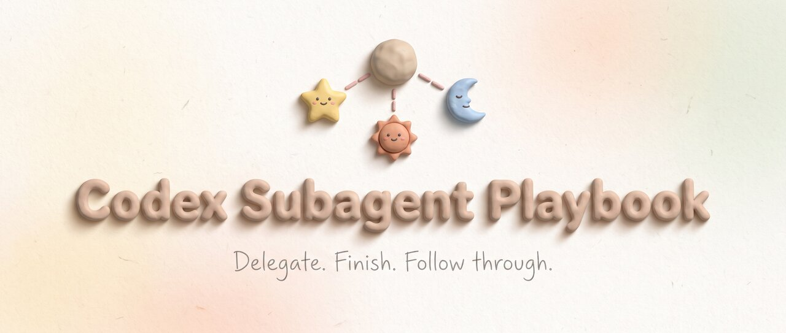

# codex-subagent-playbook



[](https://developers.openai.com/codex/cli)
[](https://developers.openai.com/codex/skills/)
[](LICENSE)

A Codex plugin for choosing subagent models and managing delegated work through completion. It selects a model and reasoning effort based on the assigned task and supplied documents. It also defines how the main session waits for subagents, intervenes when needed, and checks their results before reporting completion.

The plugin contains one Agent Skill. Use it with individual subagents or an existing workflow.

---

## Quick Start

Requires the latest Codex CLI and access to GPT-6 Astra, GPT-5.6 Sol, and GPT-5.6 Luna.

Register the marketplace directly from GitHub:

```bash
codex plugin marketplace add shinpr/codex-subagent-playbook
```

In Codex, open `/plugins`. Find **Subagent Playbook** in **Codex Subagent Playbook**, install it, and start a new session. You can confirm the installation by opening the skill picker and checking that `subagent-playbook:subagent-delegation` is listed.

The skill can activate automatically when Codex considers or manages subagents. For a first task, try:

```text
Use subagents to implement this work plan and review the result.
```

To request the skill explicitly, select `subagent-playbook:subagent-delegation` from the skill picker before sending your request.

---

## Model Selection

The defaults reflect the author's measurements and daily use. Astra handles research and review because judging what is worth changing matters there, and those tasks consume more input than output. Sol handles design after the direction has been set. Luna handles implementation from supplied documents to keep execution costs down, with Astra providing the review that can catch mistakes and redirect the work.

| Task | Model | Effort |
|---|---|---|
| Analysis, research, and direction setting | Astra | medium |
| Design | Sol | high |
| Implementation | Luna | max |
| Review | Astra | medium |
| Urgent work, including incident investigation and response | Astra | medium |

These are the model and effort choices Codex applies when starting a child. Explicit user choices and existing host or role constraints take precedence.

The implementation and urgency rules are:

- Implementation uses Astra medium when neither a design document nor a work plan is designated as an input.
- Creating or changing a web UI's appearance also requires a UI specification or mockup to use Luna. Otherwise, it uses Astra medium.
- Urgent work uses Astra medium, taking precedence over the ordinary task categories.

The implementation rules check which inputs are supplied, not whether their contents pass a design review. Point Codex to the documents you already have; work can proceed with Astra medium when those inputs are absent. The web UI rule reflects the author's experience with UI generation.

<details>
<summary>Background on the defaults</summary>

- [Reasoning Effort Is Not a Quality Setting](https://www.norsica.jp/blog/reasoning-effort-is-not-a-quality-setting) compares design, implementation, and review across several configurations, including Sol high and Luna max.
- [Astra and Sol in Galley: Evaluation Methods and Results](https://www.norsica.jp/resources/astra-effort-evaluation) compares Astra effort levels with Sol high in analysis, implementation, and code review.

These are case studies from one repository. They inform the defaults alongside daily use; the web UI rule remains an experience-based choice rather than a result of these evaluations.

</details>

---

## Delegation

Small tasks can stay in the main session when delegation would add unnecessary coordination. Each child receives an outcome, scope, and the inputs needed to do the work. It owns the assignment through the required verification and chooses how to carry it out within those boundaries.

The main session handles necessary work outside the child's assignment or waits for its notification. A wait timeout leaves the assignment pending. The parent continues waiting unless a decision request, a task change, or evidence of an assignment error calls for intervention.

The child initiates consultation when it needs a decision beyond its assignment. For example, if a fix requires changing a public API outside the agreed scope, the child brings that decision and its supporting evidence to the parent while continuing unaffected work.

When a child finishes, the parent checks the deliverable and applies the required review. It receives every required child result before producing the final answer.

---

## License

[MIT](LICENSE)
